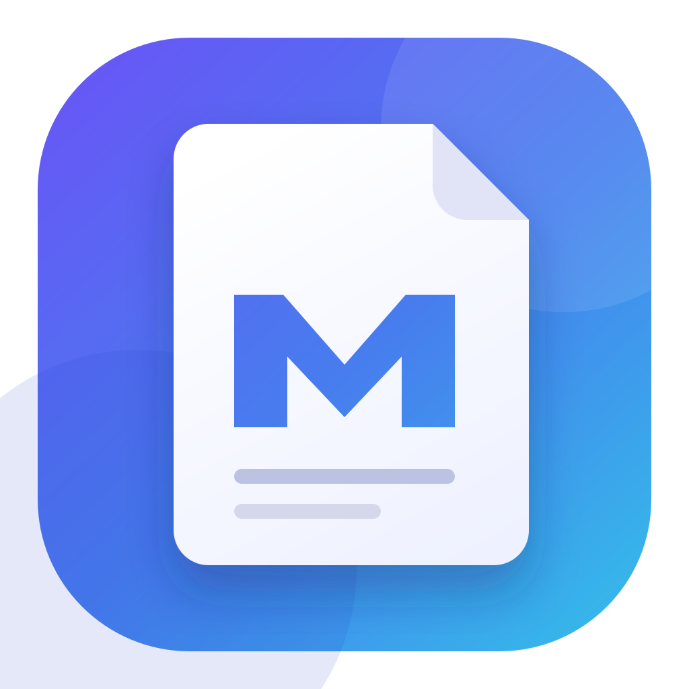

<p align="center">
  
</p>

<h1 align="center">ReaderMD</h1>

<p align="center">
  <strong>Markdown deserves a real reading app.</strong><br>
  A native, offline-first workspace for documents that should feel finished,
  not merely rendered.
</p>

<p align="center">
  <a href="LICENSE"></a>
  
  
  
</p>

ReaderMD turns Markdown into a calm, native document experience: beautiful
reading, direct editing, source and split views, tabs, folders, Quick Look,
search, diagrams, math, code, and export — with no account and no network
required for rendering.

It began as a late-night macOS project by
[Adam Jesionkiewicz](mailto:adam@jesion.pl). It is now open source because the
interesting version of this idea is bigger than one app and one platform.

**The macOS app is ready today. Ports, shared foundations, new workflows, and
surprising ideas are welcome.**

<p align="center">
  <a href="assets/screenshots/readermd-reading-workspace.png">
    
  </a>
</p>

<p align="center">
  <sub>A calm native workspace for reading, navigating, and understanding Markdown.</sub>
</p>

## Why it is fun to work on

ReaderMD sits at an unusually good intersection:

- **native app craft** — real macOS windows, menus, tabs, Quick Look, printing,
  drag and drop, and accessibility;
- **document engineering** — files stay files, links remain meaningful, and
  local images work offline;
- **web rendering without a web service** — the document engine is bundled and
  deterministic;
- **design with visible results** — typography, layout, interaction, and export
  quality are immediately testable;
- **room to grow** — the renderer and document behaviors can become a shared
  foundation for Windows, Linux, and other front ends.

You do not need to understand the whole application to contribute. A focused
test, a better empty state, a renderer edge case, a documentation fix, or a
porting experiment can all be excellent first changes.

## Highlights

- GitHub Flavored Markdown, tables, task lists, alerts, footnotes, and badges
- Direct rich-text editing in the rendered document
- Preview, source, and synchronized split modes
- Diagrams, charts, math, syntax highlighting, local images, and relative links
- Tabs, recent files, pinning, folders, full-content search, and drag and drop
- Reading-width controls, custom reading styles, focus mode, and dark mode
- A sandboxed Finder Quick Look extension bundled with the app
- PDF export, printing, rich copy, and DOCX export
- Fully local rendering with pinned resources — documents never leave the Mac

## Source and preview stay in sync

Move between source, split, and document views without giving up typography,
math, syntax highlighting, callouts, or diagrams.

<p align="center">
  <a href="assets/screenshots/readermd-split-view.png">
    
  </a>
</p>

<p align="center">
  <sub>Source on the left, finished document on the right — rendered entirely offline.</sub>
</p>

## Try it locally

You need macOS 14 or newer, Xcode with Swift 6.1 support, and the Xcode command
line tools selected.

```bash
git clone https://github.com/ashtree74/ReaderMD.git
cd ReaderMD
swift run ReaderMD
```

Run the test suite:

```bash
swift test
python3 -m unittest discover -s site -p 'test_*.py'
```

Build the Universal 2 app bundle used for local testing:

```bash
./scripts/build-app.sh
open dist/ReaderMD.app
```

The local build is ad-hoc signed unless `PREVIEWMD_SIGNING_IDENTITY` is set.
Official signing and notarization credentials are never required for normal
development.

## Pick a place to start

- Look for issues labeled
  [`good first issue`](https://github.com/ashtree74/ReaderMD/labels/good%20first%20issue)
  or [`help wanted`](https://github.com/ashtree74/ReaderMD/labels/help%20wanted).
- Reproduce a bug and turn it into a failing test.
- Improve keyboard navigation, VoiceOver behavior, or reduced-motion support.
- Bring a tricky real-world Markdown document and make its behavior excellent.
- Explore a Windows or Linux shell around the portable renderer; start with the
  [porting guide](docs/PORTING.md).
- Improve the landing page or its dependency-free Python service.

If an idea is architectural or will take more than a small pull request, open an
issue first. A short design conversation is much cheaper than polishing the
wrong abstraction.

Read [CONTRIBUTING.md](CONTRIBUTING.md) for the complete workflow. The project
uses the lightweight [Developer Certificate of Origin](DCO), so commits need a
`Signed-off-by` line created with `git commit -s`.

## How the project fits together

```text
Sources/ReaderMD/             Native macOS application and document model
Sources/ReaderMDQuickLook/    Bundled Finder Quick Look extension
Sources/ReaderMD/Resources/   Offline document renderer and its assets
Tests/ReaderMDTests/          Behavior and regression tests
scripts/                       Universal 2 build, signing, and release tooling
site/                          Landing page and tiny mailing-list service
deploy/                        Example production deployment configuration
```

Swift owns documents, windows, file access, native editing, export, and system
integration. A bundled web view owns Markdown presentation. That boundary makes
the current app deeply native while leaving a practical seam for future ports.
See [the porting guide](docs/PORTING.md) and the deeper developer notes in
[CLAUDE.md](CLAUDE.md).

## Project direction

ReaderMD is intentionally founder-led, but contribution-friendly. Adam is the
founder and lead maintainer; design and implementation happen in public through
issues and pull requests. Trusted contributors can grow into reviewers and
maintainers as the community grows.

The north star and near-term opportunities live in [ROADMAP.md](ROADMAP.md).
Decision-making and maintainer roles are described in
[GOVERNANCE.md](GOVERNANCE.md).

## Releases and trust

Anyone may build and distribute ReaderMD under Apache-2.0. The currently
published macOS binaries are signed and notarized through the Apple Developer
account of Astrography Sp. z o.o., which distributes them under the same
Apache-2.0 license available to everyone.

Only releases linked by this repository should be treated as official project
builds. Forks and experiments are welcome; please follow
[the trademark policy](TRADEMARKS.md) when naming public distributions.

## License and authorship

ReaderMD is licensed under the [Apache License 2.0](LICENSE).

Copyright © 2026 [Adam Jesionkiewicz](AUTHORS.md) and ReaderMD contributors.
ReaderMD was conceived, designed, and originally implemented by Adam
Jesionkiewicz. Accepted contributions remain credited through Git history and
are provided under the same Apache-2.0 terms.

The project name and visual identity are not granted for confusing or
endorsement-implying use; see [TRADEMARKS.md](TRADEMARKS.md). Bundled third-party
software and its licenses are documented in
[THIRD_PARTY_NOTICES.md](THIRD_PARTY_NOTICES.md) and shipped with the app.

## Community

- Questions and ideas: [GitHub Discussions](https://github.com/ashtree74/ReaderMD/discussions)
- Bugs and proposals: [GitHub Issues](https://github.com/ashtree74/ReaderMD/issues)
- Security reports: [SECURITY.md](SECURITY.md)
- Expected behavior: [CODE_OF_CONDUCT.md](CODE_OF_CONDUCT.md)

Bring a document, an idea, or a platform. Let us make Markdown feel finished.
