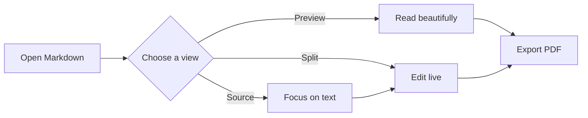
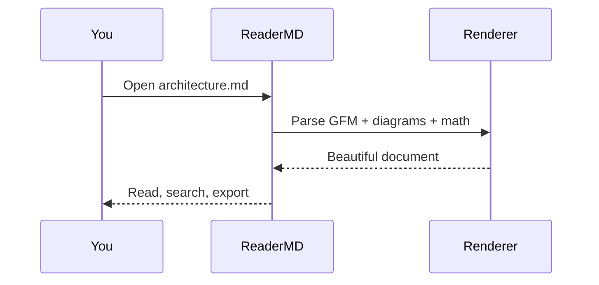

# ReaderMD

> [!TIP]
> Drop any `.md` file into the window. ReaderMD renders everything locally, so your documents stay on your Mac.

A focused Markdown reader built for **beautiful technical documents**. It combines a calm, print-inspired canvas with the power you expect from a serious developer tool.


## Project pulse

| Area | Status | Owner | Progress |
| :--- | :---: | :--- | ---: |
| Native macOS shell | ✅ Ready | Design | 100% |
| Markdown reading and editing | ✅ Ready | Platform | 100% |
| Diagrams, math, and code | ✅ Ready | Content | 100% |
| Agent edit review | ✅ Ready | Automation | 100% |
| Quick Look and PDF export | ✅ Ready | Files | 100% |

## What ReaderMD can do

- **Read and edit in place.** Switch between Document, Split, and Source views without leaving the window.
- **Work with whole folders.** Browse a collapsible document tree, search file contents, and open results in tabs.
- **Handle technical Markdown.** Tables, task lists, highlighted code, equations, diagrams, local images, and relative links all work offline.
- **Edit diagrams visually.** Common flowcharts can be adjusted on a canvas while ReaderMD keeps the Markdown source portable.
- **Review agent edits.** Keep Live Reload on while an AI agent or another app writes the file: ReaderMD highlights affected sections, lets you jump between them, opens a native diff, and keeps unsaved local work safe.
- **Stay focused.** Use the outline, document search, Focus mode, live reload, adjustable reading width, themes, and reading styles.
- **Use Markdown across macOS.** The built-in Quick Look extension previews files in Finder, while native sharing and PDF export handle delivery.

## Built for agent workflows

ReaderMD is agent-ready without locking you to one AI provider. Agents work on ordinary Markdown files, and ReaderMD watches those files locally. Clean documents update automatically with changed blocks highlighted; if you already have unsaved edits, ReaderMD preserves them and shows the incoming disk changes as a conflict instead.

Use the **External Edits** controls in the status bar to move through every changed section, open the full line-by-line diff, and mark the review complete.

## Workflow at a glance



## Built for real documentation

- [x] GitHub Flavored Markdown tables and task lists
- [x] Syntax highlighting with one-click copy
- [x] Flowcharts, sequence diagrams, ER models, Gantt charts, and more
- [x] Inline math like $E = mc^2$ and display equations
- [x] Footnotes, local images, relative links, and automatic URLs
- [ ] Your next excellent document

### Mathematics, typeset properly

The Gaussian integral, set the way print would set it:

$$
\int_{-\infty}^{\infty} e^{-x^2}\,dx = \sqrt{\pi}
$$

### Code that feels at home

```swift
struct DocumentPreview: View {
    let markdown: String

    var body: some View {
        Reader(markdown)
            .readingWidth(.comfortable)
            .focusable()
    }
}
```

> [!NOTE]
> Use the outline on the right to jump between sections. Press **⌘F** to search, **⌘O** to open files, and **⌘⇧E** to export a polished PDF.

## A sequence diagram



## Small details, big difference

Long tables scroll instead of breaking the page. Code blocks keep their language label. Links to local Markdown open as new tabs, while web links open in your browser. Your reading style, theme, reading width, paper mode, and recents persist between launches.

> [!IMPORTANT]
> Rendering is offline. ReaderMD does not upload the contents of your documents.

---

**Author:** Adam Jesionkiewicz · [adam@jesion.pl](mailto:adam@jesion.pl)
